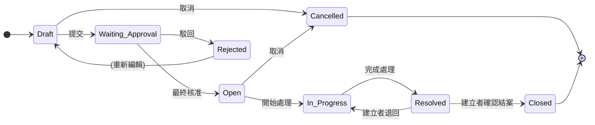
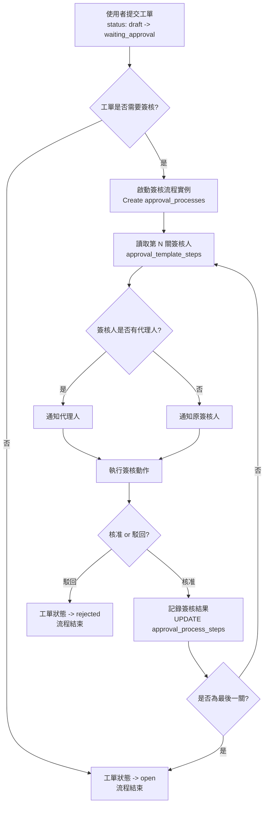
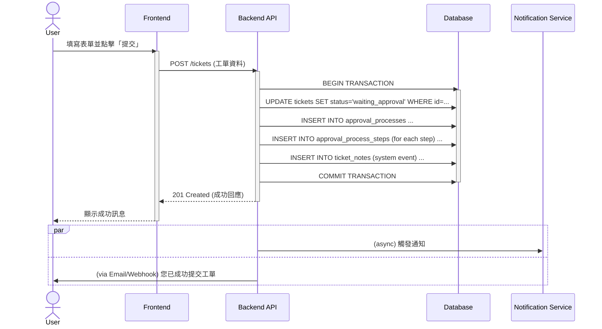

# 企業級智慧工單系統 - 系統規格說明書 (System Specification)

**文件版本**: v1.0
**基於資料庫 Schema 版本**: v1
**最後更新日期**: 2025-09-14

## 1. 系統概述

本文件旨在詳細定義「企業級智慧工單系統」的技術規格、功能模組、業務邏輯與 API 設計。系統核心是圍繞著一個高度彈性的工單 (Ticket) 實體，整合了可自訂的範本 (Template)、多層級的簽核流程 (Approval Process)、精細的權限控制 (Permission) 以及一個統一的事件時間軸 (Timeline)，旨在打造一個可追溯、高效率且符合企業規範的內部服務管理平台。

本文件是開發團隊（包含前端、後端、QA）進行系統實作的主要技術依據。

## 2. 系統架構

- **前端**: Vue 3 (Composition API) + Vite + TypeScript + Vuetify + Pinia
- **後端**: Python 3.12 + FastAPI + SQLAlchemy 2.0
- **資料庫**: PostgreSQL 16+
- **核心理念**: Schema-First。所有業務邏輯與 API 設計皆嚴格基於 v1 版本的資料庫結構。

## 3. 資料模型與 Schema 詳解 (Data Model)

本系統的資料結構是所有功能的基石。以下為 ticket 系統的結構與註解。

*(完整的 SQL Schema 內容應放置於此，為求簡潔，此處省略，請參考 `ticket_system_schema.sql`)*

### 核心概念對應：

- **工單 (Ticket)**: `tickets` 表，系統最核心的操作實體。
- **工單範本 (Ticket Template)**: `ticket_templates` 表，定義工單的藍圖。
- **簽核範本 (Approval Template)**: `approval_templates` 與 `approval_template_steps` 表，定義可重複使用的簽核流程。
- **簽核流程實例 (Approval Process)**: `approval_processes` 與 `approval_process_steps` 表，代表一個基於範本的、正在運行的具體簽核流程。
- **統一時間軸 (Unified Timeline)**: `ticket_notes` 表，記錄所有使用者留言與系統事件。
- **通用實體**: `categories`, `labels` 表，可供工單與範本重複使用。
- **權限控制 (Permissions)**: `tickets.visibility` 欄位與 `ticket_view_permissions` 表共同作用。

## 4. 功能模組規格 (Functional Specifications)

### 4.1 工單生命週期管理 (Ticket Lifecycle Management)

工單的 `status` 欄位是其生命週期的核心。狀態轉換必須遵循以下規則：

| 當前狀態 (From)    | 目標狀態 (To)      | 觸發條件 / 角色    | 附帶動作 (Side Effects)                                                      |
| ------------------ | ------------------ | ------------------ | ---------------------------------------------------------------------------- |
| `draft`            | `waiting_approval` | 建立者提交         | 建立 `approval_processes` 實例，發送通知給第一關簽核人。                     |
| `draft`            | `cancelled`        | 建立者             | -                                                                            |
| `waiting_approval` | `rejected`         | 任一簽核人駁回     | 更新 `approval_processes` 狀態，發送通知給建立者。                           |
| `waiting_approval` | `open`             | 最後一關簽核人核准 | 更新 `approval_processes` 狀態為 `approved`，指派處理人員 (若有)，發送通知。 |
| `open`             | `in_progress`      | 指派的處理人員     | 發送通知給建立者。                                                           |
| `open`             | `cancelled`        | 建立者 / 管理員    | -                                                                            |
| `in_progress`      | `resolved`         | 處理人員           | 發送通知給建立者進行確認。                                                   |
| `resolved`         | `closed`           | 建立者             | 觸發 `on_close` 通知規則。                                                   |
| `resolved`         | `in_progress`      | 建立者 (退回)      | 發送通知給處理人員。                                                         |

### 4.2 簽核流程引擎 (Approval Engine)

此引擎負責管理從範本到實例的整個簽核流程。

1. **流程啟動**:
    - 當 `tickets.status` 從 `draft` 變為 `waiting_approval` 時觸發。
    - 系統讀取 `tickets.approval_template_id`。
    - 建立一筆 `approval_processes` 記錄，並關聯到該 `ticket_id`。
    - 根據 `approval_template_id` 查詢所有 `approval_template_steps`，並在 `approval_process_steps` 中為每一關建立對應的記錄，狀態為 `pending`。
2. **關卡推進**:
    - 當一筆 `approval_process_steps` 的 `status` 被更新為 `approved` 時：
        - 系統檢查是否為最後一關。
        - 若否，則更新 `approval_processes.current_step` 指向下一關，並通知下一關的簽核人。
        - 若是，則更新 `approval_processes.status` 為 `approved`，並觸發工單狀態變為 `open`。
3. **代理人簽核邏輯**:
    - 在取得某個 `step` 的應簽核人 (`approver_id`) 時，後端需額外查詢該使用者的代理人設定 (此為外部系統邏輯)。
    - 若有代理人，則通知代理人。
    - 當代理人執行簽核動作時，API 需同時傳入 `proxy_id`。後端將 `approver_id` (原簽核人) 與 `proxy_id` (代理人) **同時**寫入 `approval_process_steps` 表的對應欄位。

### 4.3 統一事件時間軸 (Unified Event Timeline)

`ticket_notes` 表是所有歷史紀錄的唯一來源。

- **使用者留言 (User Note)**:
    - 當使用者新增一筆留言時，`INSERT` 一筆記錄到 `ticket_notes`。
    - `system` 欄位必須為 `FALSE`。
    - `note` 欄位儲存留言內容。
    - `event_type` 與 `event_details` 必須為 `NULL`。
- **系統事件 (System Event)**:
    - 當後端執行任何會改變工單狀態或重要屬性的操作時，必須**額外** `INSERT` 一筆記錄到 `ticket_notes`。
    - `system` 欄位必須為 `TRUE`。
    - `event_type` 必須記錄事件類型 (e.g., `status_change`, `label_add`)。
    - `event_details` 必須以 JSON 格式儲存上下文資訊 (e.g., `{"from": "open", "to": "in_progress"}` 或 `{"label_name": "緊急"}`）。
    - `note` 欄位必須為 `NULL`。

### 4.4 權限與可見性 (Permissions & Visibility)

工單的讀取權限是系統的核心安全機制。權限系統採用角色優先的設計，結合靜態權限與業務邏輯驅動的權限檢查。

#### 4.4.1 靜態權限 (Static Permissions)
1. **查詢工單列表 (`GET /tickets`)**:
    - 後端必須先篩選出 `visibility = 'internal'` 的工單。
    - 再 `UNION` 上 `visibility = 'restricted'` 且當前使用者 `user_id` 或 `role_id` 存在於 `ticket_view_permissions` 表中的工單。
2. **查詢單一工單 (`GET /tickets/{id}`)**:
    - 先取得該工單。
    - 若 `ticket.visibility = 'internal'`，則允許訪問。
    - 若 `ticket.visibility = 'restricted'`，則必須檢查以下條件之一：
        - 當前使用者 `user_id` 或 `role_id` 存在於 `ticket_view_permissions` 記錄中。
        - **業務參與者自動權限**：當前使用者為該工單的開單者 (`tickets.created_by`)、當前或歷史簽核人（包括代理人，來自 `approval_process_steps.approver_id` 或 `proxy_id`）。
    - 若以上條件皆不符合，則返回 `403 Forbidden` 或 `404 Not Found`。

#### 4.4.2 業務邏輯權限 (Business Logic Permissions)
系統進一步強化 restricted 工單的權限邏輯，確保業務流程參與者能順暢訪問：

1. **業務參與者權限範圍**:
    - **開單者**: 工單建立者 (`tickets.created_by`) 永久擁有該工單的完整權限。
    - **簽核人**: 當前或歷史簽核人（包括代理人）擁有查看權限，簽核期間可進行簽核操作。
    - **處理人員**: 若工單已指派處理人員 (`tickets.assigned_to`)，則該人員擁有查看權限。
    - **管理員**: 管理員角色自動擁有所有工單的完整權限。

2. **權限請求流程**:
    - 若非業務參與者嘗試訪問 restricted 工單，系統提供「請求權限」功能。
    - 使用者可提交權限請求，包含理由，發送給工單建立者或管理員審批。
    - 審批通過後，在 `ticket_view_permissions` 表中新增記錄。

3. **權限審計**:
    - 所有權限訪問記錄在 `ticket_notes` 中作為系統事件。
    - 包含訪問者 ID、時間戳與訪問類型。

此設計避免了臨時權限的複雜管理，同時確保簽核流程的順暢進行。

### 4.5 通知服務 (Notification Service)

此服務應為異步觸發 (Asynchronous Triggering)。

1. **觸發點**: 在工單的業務邏輯執行完畢後（例如，狀態變更、新增留言）。
2. **執行邏輯**:
    - 根據觸發的事件類型 (e.g., `on_close`) 和 `ticket_id` / `ticket_template_id`，查詢 `notification_rules` 表。
    - 取得所有符合條件的 `rule_id`。
    - 根據 `rule_id` 查詢 `notification_rule_users` 和 `notification_rule_roles`，解析出所有需要被通知的 `user_id` 和 `role_id`。
    - 去重後，將通知任務推送至訊息佇列 (如 Kafka) 或直接調用通知發送服務。

## 5. API 端點設計 (High-Level API Endpoints)

以下為建議的 RESTful API 資源與端點設計。

### 5.1 工單 (Tickets)

- `GET /tickets`: 查詢工單列表 (需實作權限過濾)。
- `POST /tickets`: 建立新工單。
- `GET /tickets/{ticket_id}`: 取得單一工單詳細資訊。
- `PUT /tickets/{ticket_id}`: 更新工單核心資訊 (e.g., title, description)。
- `PATCH /tickets/{ticket_id}/status`: 變更工單狀態 (專用端點以控制生命週期)。

### 5.2 工單關聯資源 (Ticket Sub-resources)

- `GET /tickets/{ticket_id}/notes`: 取得工單的完整時間軸。
- `POST /tickets/{ticket_id}/notes`: 新增一筆使用者留言。
- `GET /tickets/{ticket_id}/attachments`: 取得工單主體的附件列表。
- `POST /tickets/{ticket_id}/attachments`: 為工單新增附件。
- `GET /tickets/{ticket_id}/labels`: 取得工單的標籤列表。
- `POST /tickets/{ticket_id}/labels`: 為工單新增標籤。
- `DELETE /tickets/{ticket_id}/labels/{label_id}`: 移除工單的標籤。
- `GET /tickets/{ticket_id}/permissions`: 取得機密工單的權限設定。
- `POST /tickets/{ticket_id}/permissions`: 新增/修改機密工單的權限。

### 5.3 簽核 (Approvals)

- `GET /approvals/my-pending`: 查詢當前使用者待簽核的步驟。
- `POST /approval-process-steps/{step_id}/approve`: 核准某個簽核步驟。
- `POST /approval-process-steps/{step_id}/reject`: 駁回某個簽核步驟。

### 5.4 管理資源 (Management Resources)

- `GET, POST /ticket-templates`
- `GET, PUT /ticket-templates/{id}`
- `GET, POST /approval-templates`
- `GET, PUT /approval-templates/{id}`
- `GET, POST /categories`
- `GET, POST /labels`

## 6. 非功能性需求 (Non-Functional Requirements)

- **效能**:
    - P95 API 回應時間應小於 500ms。
    - 資料庫查詢應善用索引，複雜查詢應進行 `EXPLAIN ANALYZE` 分析。
- **安全性**:
    - 所有 API 端點皆需通過身份驗證與授權。
    - 防止 SQL Injection (透過 SQLAlchemy ORM)。
    - 對附件上傳進行檔案類型與大小限制。
- **資料一致性**:
    - 所有涉及多表寫入的操作 (如提交簽核) 必須使用資料庫事務 (Transaction)。

## 7. 附錄

### 7.1 工單狀態機 (Ticket State Machine)

### 7.2 術語表

- **Schema**: 資料庫結構定義。
- **Endpoint**: API 的網路端點/接口。
- **P95 Latency**: 95% 的請求都在此時間內完成。

### 7.3 簽核流程圖 (Approval Flowchart)

### 7.4 建立工單時序圖 (Create Ticket Sequence Diagram)

